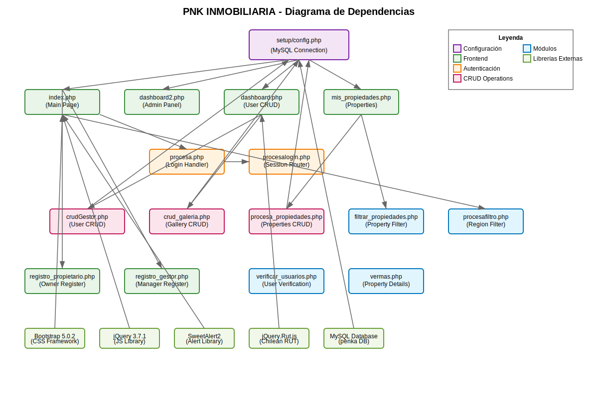

# PNK INMOBILIARIA 🏠

Sistema de gestión inmobiliaria desarrollado en PHP especializado en la **Región de Coquimbo, Chile**. Permite la administración completa de propiedades, usuarios y transacciones inmobiliarias con enfoque geográfico específico.


## 🚀 Características Principales

- **Gestión de Usuarios**: Sistema de roles (Administradores, Gestores Inmobiliarios Free, Propietarios)
- **Gestión de Propiedades**: CRUD completo con características detalladas (baños, dormitorios, amenidades)
- **Sistema de Autenticación**: Login seguro con encriptación bcrypt y validaciones robustas
- **Filtros Geográficos**: Búsqueda jerárquica por Región → Provincia → Comuna → Sector
- **Galería de Imágenes**: Sistema de fotos múltiples con imagen principal
- **Validaciones Chilenas**: RUT con dígito verificador, teléfonos móviles (+569), correos
- **Tipos de Propiedades**: Casas, Departamentos y Terrenos
- **Precios Duales**: Manejo en Pesos Chilenos y UF (Unidad de Fomento)
- **Interfaz Responsiva**: Diseño adaptable con Bootstrap 5.0.2

## 🛠️ Tecnologías Utilizadas

### Backend
- **PHP**: Lenguaje principal del servidor
- **MySQL**: Base de datos relacional (BD: penka)
- **WAMP/XAMPP**: Servidor de desarrollo local

### Frontend
- **HTML5**: Estructura del contenido
- **CSS3**: Estilos personalizados
- **JavaScript**: Interactividad del cliente
- **Bootstrap 5.0.2**: Framework CSS responsivo
- **jQuery 3.7.1**: Biblioteca JavaScript
- **SweetAlert2**: Alertas elegantes
- **jQuery.Rut.js**: Validación de RUT chileno

## 📁 Estructura del Proyecto

```
pnk/
├── css/                    # Estilos CSS
│   ├── dashboard.css
│   ├── inicio.css
│   ├── login.css
│   └── ...
├── js/                     # JavaScript
│   ├── jquery-3.7.1.min.js
│   └── jquery.Rut.js
├── img/                    # Imágenes del sistema
├── setup/                  # Configuración
│   └── config.php         # Conexión a BD
├── propiedades/           # Archivos de propiedades
├── index.php              # Página principal
├── dashboard.php          # Panel de administración
├── procesa.php           # Procesamiento de login
└── ...
```

## 🔧 Instalación

### Prerrequisitos
- WAMP, XAMPP o servidor con PHP 7.4+
- MySQL 5.7+
- Navegador web moderno

### Pasos de Instalación

1. **Clonar el repositorio**
   ```bash
   git clone https://github.com/tu-usuario/pnk-inmobiliaria.git
   cd pnk-inmobiliaria
   ```

2. **Configurar la base de datos**
   - Crear una base de datos llamada `penka`
   - Importar el esquema SQL (si está disponible)
   - Configurar las credenciales en `setup/config.php`

3. **Configurar conexión**
   ```php
   // setup/config.php
   define('DB_HOST', 'localhost');
   define('DB_USER', 'tu_usuario');
   define('DB_PASS', 'tu_contraseña');
   define('DB_NAME', 'penka');
   ```

4. **Ejecutar el proyecto**
   - Iniciar servidor local (WAMP/XAMPP)
   - Navegar a `http://localhost/pnk`

## 👥 Tipos de Usuario

### 🔑 Administrador (Tipo 3)
- Acceso completo al sistema
- Gestión de usuarios y propiedades
- Panel de administración avanzado

### 🏢 Gestor Inmobiliario Free (Tipo 1)
- Gestión básica de propiedades
- Requiere certificado profesional
- Funcionalidades limitadas

### 🏠 Propietario (Tipo 2)
- Gestión de sus propias propiedades
- Vista de propiedades personales
- Registro simplificado

## 🔐 Características de Seguridad

- **Validación de Contraseñas**: Mínimo 8 caracteres, mayúsculas, minúsculas y caracteres especiales
- **Validación de RUT**: Formato y dígito verificador chileno
- **Validación de Email**: Formato estándar de correo electrónico
- **Control de Sesiones**: Gestión segura de sesiones de usuario
- **Sanitización de Datos**: Prevención de inyección SQL

## 📊 Funcionalidades Principales

### 🏠 Gestión de Propiedades
- Crear, editar, eliminar propiedades
- Subida de imágenes múltiples
- Filtros por ubicación y tipo
- Vista detallada de propiedades

### 👥 Gestión de Usuarios
- Registro de nuevos usuarios
- Validación de datos chilenos (RUT)
- Gestión de estados (activo/inactivo)
- Tipos de usuario diferenciados

### 🔍 Sistema de Filtros
- Filtro por región, provincia, comuna
- Filtro por tipo de propiedad
- Búsqueda dinámica con AJAX
- Paginación de resultados

## 🎨 Interfaz de Usuario

- **Diseño Responsivo**: Compatible con dispositivos móviles
- **Bootstrap 5**: Framework CSS moderno
- **SweetAlert2**: Alertas atractivas y funcionales
- **Iconografía**: Iconos intuitivos para navegación
- **Paleta de Colores**: Diseño profesional inmobiliario

## 📈 Diagrama de Dependencias



El sistema está estructurado en módulos independientes que interactúan a través de:
- **Configuración Central**: `setup/config.php`
- **Autenticación**: `procesa.php`, `procesalogin.php`
- **CRUD Operations**: Módulos especializados
- **Frontend**: Páginas de interfaz de usuario

## 🔄 Flujo de Trabajo

1. **Autenticación**: Usuario accede mediante `index.php`
2. **Validación**: `procesa.php` valida credenciales
3. **Redirección**: `procesalogin.php` redirige según tipo de usuario
4. **Gestión**: Acceso a módulos según permisos
5. **Operaciones**: CRUD en base de datos MySQL

## 🤝 Contribución

1. Fork el proyecto
2. Crea una rama para tu feature (`git checkout -b feature/AmazingFeature`)
3. Commit tus cambios (`git commit -m 'Add some AmazingFeature'`)
4. Push a la rama (`git push origin feature/AmazingFeature`)
5. Abre un Pull Request

## 📝 Licencia

Este proyecto está bajo la Licencia MIT - ver el archivo [LICENSE.md](LICENSE.md) para detalles.

## 📞 Contacto

**PNK Inmobiliaria**
- Email: contacto@pnkinmobiliaria.cl
- Instagram: [@tioreneoficial_](https://www.instagram.com/tioreneoficial_/?hl=es)
- LinkedIn: [PNK Inmobiliaria](https://www.ticketmaster.cl/event/popin-un-show-muy-penca-centro-cultural-san-gines)

## 🙏 Agradecimientos

- Bootstrap por el framework CSS
- jQuery por la biblioteca JavaScript
- SweetAlert2 por las alertas elegantes
- Comunidad PHP por el soporte continuo

---

⭐ **¡Dale una estrella al proyecto si te fue útil!**

```
© 2025 Todos los derechos Reservados PNK Inmobiliaria
```
